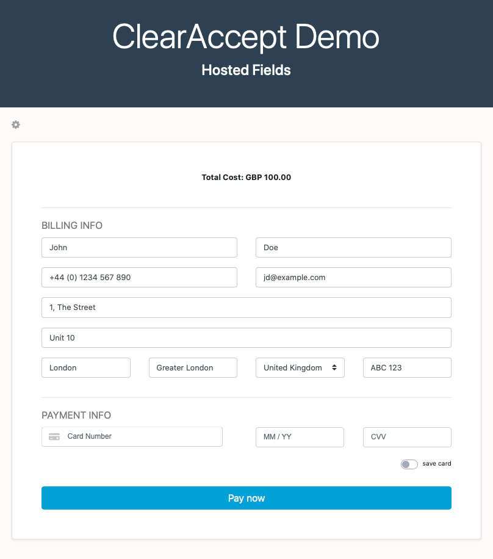
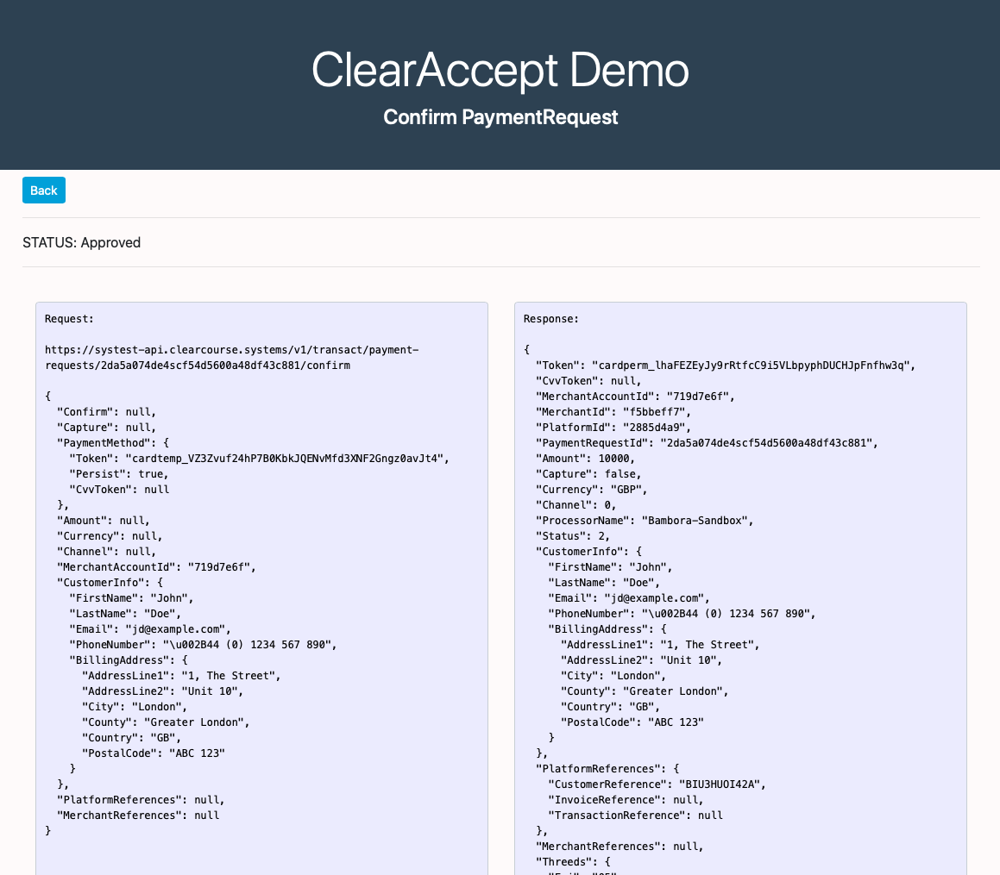

# ClearAccept Hosted Fields Demo

## The goal of this demo
This is an example of how the ClearAccept Hosted Fields can be integrated into a web application.

## Steps to run the application

To run the application locally, follow these steps:
1. Open a command line interface and clone to your local computer using `git`.
```shell
git clone https://github.com/clearaccept/ClearAcceptDemo
```
2. Make sure you have .NET Core 3.0 SDK installed. See instruction from [here](https://dotnet.microsoft.com/download/dotnet-core/3.0).
3. Navigate inside the folder where the repository was cloned, to the demo project folder.
```shell
cd ClearAcceptDemo\ClearAcceptDemo
``` 
4. Copy appsettings.example.json to appsettings.json
```shell
copy appsettings.example.json appsettings.json
``` 
5. Edit appsettings.json and enter your credentials and platform ids in their placeholders:

6. Use `dotnet run` in command line to start the demo server.
```shell
dotnet run
```
7. Open any Browser and navigate to https://localhost:44331/ to acces the demo page.


## About the Demo Project
The Hosted Fields library imported from https://sandbox-hosted.clearaccept.systems/fields/v1 will inject iframes into the wrappers provided.
These iframes will contain the Card Number, Card Expiry Date and CVV fields hosted by ClearAccept, ensuring that sensitive card data is collected directly from the card holder.

Upon starting this application the following are executed:
1. A PaymentRequest is created by calling TransactAPI from the backend
2. The PaymentRequestId from the response in (1) is exchanged for a FieldToken with TransactAPI
3. The FieldToken is then passed to the View where the HostedFields library is imported
4. The HostedFields are initialsied using the FieldToken and other settings
5. The fields are now displayed to the customer



To process a payment:
1. User populates the form with valid data
2. User clicks to pay
3. If the user chose to pay using a saved card, the PaymentRequest is updated with the associated PermanentToken
4. The tokenize method is called on the HostedFields instance
5. A TemporaryToken or CvvToken (if paying with a saved card) is returned by HostedFields
6. The token is passed to the backend where it is used to confirm the PaymentRequest
7. The results are displayed to the user


